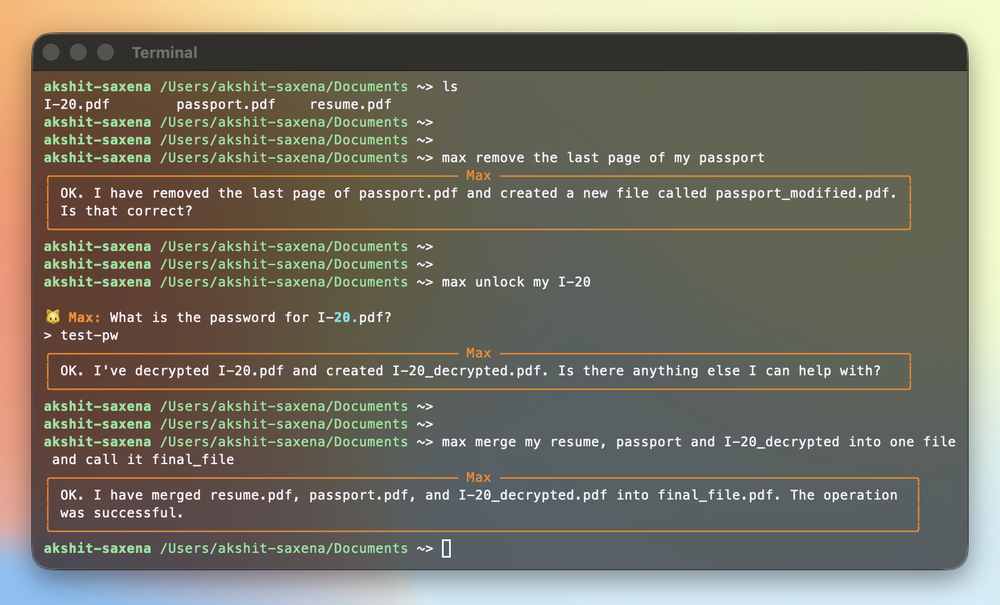

# Max 🐱

**The local, privacy-first PDF companion.**

I've been dealing with _way_ too many PDFs lately; visa forms, tax docs, leases. I usually just Google \"remove password from pdf\" or \"merge pdfs online,\". This works fine but uploading my sensitive documents (and passwords) to a random server feels wrong. Plus, the ads and tracking are annoying.

So I built **Max**.

It's a simple CLI tool that lets you manipulate PDFs using natural language. It runs locally on your machine—your files and passwords **never** leave your system. The AI (Google Gemini) just translates your English into commands; it never sees the actual content of your PDFs.



## How it works

You don't need to remember complex CLI flags. Just ask. (You don't even need quotes (""))

### 1. Lazy Merge

No need to look up exact filenames. Max uses fuzzy matching to figure out what you mean.

```bash
> max merge the tax return and the bank statement into final_application
```

### 2. Fixing Mistakes

Scanned a document upside down? Or just need page 3?

```bash
> max rotate page 2 of the lease agreement by 90 degrees
```

### 3. Privacy (Unlock)

Decrypt sensitive files without uploading them to the cloud. Max asks for the password securely if you don't provide it.

```bash
> max remove the password from my_w2_form
```

## Getting Started

### Prerequisites

- **Python 3.10+**
- **[pdfcpu](https://pdfcpu.io/)**: This is the engine Max uses under the hood.
  - Mac: `brew install pdfcpu`
  - Windows: `choco install pdfcpu`

### Installation

Clone the repo and install it in editable mode (so you can tweak the code if you want).

```bash
git clone [https://github.com/Akshiiitsaxena/max.git](https://github.com/Akshiiitsaxena/max.git)
cd max
python -m venv .venv
source .venv/bin/activate
pip install -e .
```

### Setup

Max needs a brain to understand English. Get a free API key from [Google AI Studio](https://aistudio.google.com/).

1. Create a file named `.env` in the project's root folder.
2. Paste your API key inside it like this:

```env
GOOGLE_API_KEY=your_actual_api_key_here
```

## Usage

Run `max` followed by whatever you want to do.

#### Basic mode (does what it's asked)

```bash
> max rotate the first page of modified file by 180 degrees
╭─────────────────────────────────────────── Max ───────────────────────────────────────────╮
│ OK. I have rotated the first page of modified.pdf by 180 degrees and saved it as          │
│ rotated_modified.pdf.                                                                     │
╰───────────────────────────────────────────────────────────────────────────────────────────╯
```

---

#### Verbose mode (see how it thinks) `--show-thinking`

```bash
> max rotate the first page of modified file by 180 degrees --show-thinking

> Entering new AgentExecutor chain...

Invoking: `rotate_pages` with `{'pages': '1', 'output_path': 'rotated_modified file.pdf', 'filepath': 'modified file.pdf', 'angle': 180}`

{'status': 'error', 'details': 'open modified file.pdf: no such file or directory'}
Invoking: `list_pdf_files` with `{}`

['final_file.pdf', 'CV.pdf', 'rotated_modified.pdf', 'modified.pdf', 'final_all.pdf', 'unlocked.pdf']
Invoking: `rotate_pages` with `{'pages': '1', 'output_path': 'rotated_modified.pdf', 'filepath': 'modified.pdf', 'angle': 180}`

{'status': 'success', 'output_file': 'rotated_modified.pdf'}OK. I have rotated the first page of modified.pdf by 180 degrees and saved it as rotated_modified.pdf.


> Finished chain.
╭─────────────────────────────────────────── Max ───────────────────────────────────────────╮
│ OK. I have rotated the first page of modified.pdf by 180 degrees and saved it as          │
│ rotated_modified.pdf.                                                                     │
╰───────────────────────────────────────────────────────────────────────────────────────────╯
```

## Philosophy

- **Local First:** Your PDF data stays on your disk.
- **Forgiving:** Typo a filename? Max figures it out.
- **Interactive:** If you forget to say _which_ file to rotate, Max just asks you.

---

#### Built because I was tired of `ilovepdf.com`.
